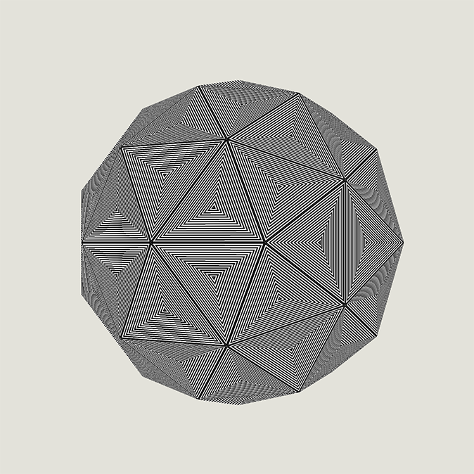

# webgl-wireframes

This is a fork of Matt DesLauriers’ [webgl-wireframes](https://github.com/mattdesl/webgl-wireframes/) modified to create concentric striping.

## Demo

Click [here](https://adamshaylor.github.io/webgl-wireframes/app/) to see a live demo.

[](https://adamshaylor.github.io/webgl-wireframes/app/)

## Usage

To build & run this project locally, first clone the repository, then use npm to install and run it:

```sh
npm install
npm start
```

Now open `localhost:9966` to see it in your browser.

To build:

```sh
npm run build
```

## Further Reading

The technique here is just one approach to wireframe rendering. You may find these other articles interesting:

- [Easy Wireframes with barycentric coordinates – Florian Bösch](http://codeflow.org/entries/2012/aug/02/easy-wireframe-display-with-barycentric-coordinates/)
- [Two Methods for Antialiased Wireframe Drawing with Hidden Line Removal](http://dl.acm.org/citation.cfm?id=1921300)
- [glsl-solid-wireframe – drawing wireframes and grids in a fragment shader by Ricky Reusser](https://github.com/rreusser/glsl-solid-wireframe)
- [Drawing Lines is Hard](https://mattdesl.svbtle.com/drawing-lines-is-hard)

## License

MIT, see [LICENSE.md](http://github.com/mattdesl/webgl-wireframes/blob/master/LICENSE.md) for details.
